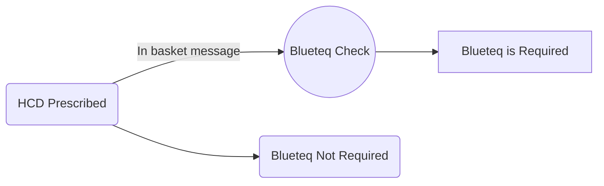

## System Wide Settings

```note
Here are the medication related message type and definitions as set in Epic Wide Settings
```

| MESSAGE TYPE | MESSAGE TYPE DEFINITION |
| --- | --- |
| CUH Rx Non Form [40822000] | NON-FORMULARY ALERT [408220001] |
| Medication Messages [220] | MEDICATION MESSAGES [220] |
| MR Allergies Interaction Alert [510] | INTERACTION LIST MESSAGE [3410] |
| Pharmacist Review [107000002] | CUH POA PHARMACIST REVIEW [1078502] |
| RX Patient Stored Medication [1287] | RX PATIENT STORE MEDICATION [10287] |
| SC insulin rebuild [40822002] | CUH RX INSULIN REBUILD [10287] |
| Vinorelbine Oral Chemo [115000001] | CUH ONC IP VINORELBINE [10038] |

-----

### Building a new custom In Basket

- [ ] Create a new category item in E0W 30 for the message type you require
>Name this as required

- [ ] Ideally copy an existing message definition template (see examples above)
>Make appropriate changes e.g. include new **message type** and naming
>Give this copied file a record ID (0.1) with a _408_ prefix

- [ ] Add these components to **Epic-wide settings** 

```danger
:bomb: :boom: TAKE CARE EDITING EPIC-WIDE SETTINGS!!! - This is maintained in **Production** :boom: :bomb:
```



